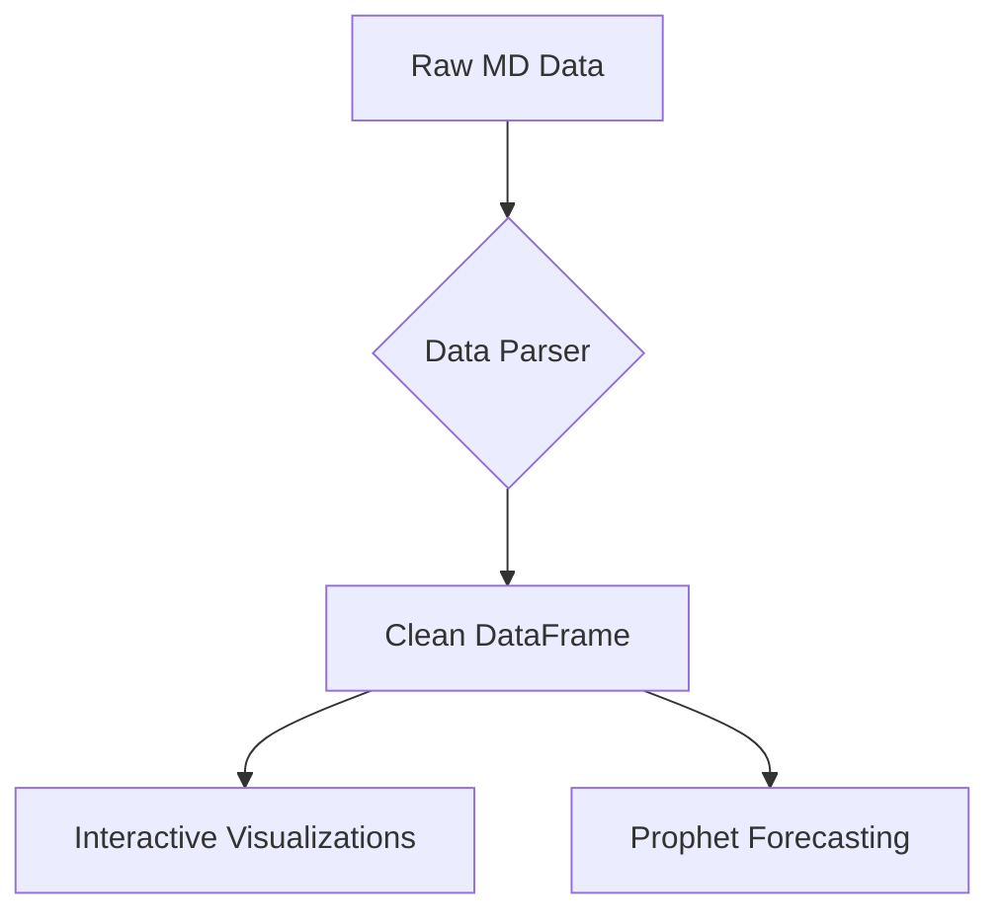

# Weibo Hot Search Analysis Tool


一个综合的仪表板，用于分析Weibo热搜趋势，具有交互式可视化和时间序列预测功能。

## Table of Contents

- [Features](#features)
- [Data Sources](#data-sources)
- [Installation](#installation)
- [Usage](#usage)
- [Technical Architecture](#technical-architecture)
- [Notes](#notes)
- [Roadmap](#roadmap)

## Features 🚀

**核心分析功能:**

- 📈 月度趋势分析与移动平均
- 📊 排名分布可视化
- ⏳ 事件持续时间统计 (Top 10 最长热搜)
- ☁️ 动态词云生成
- 🕒 小时分布模式
- 📅 交互式甘特图时间线

**高级功能:**

- 🔮 使用 Facebook Prophet 进行时间序列预测
- 🔍 交互式数据过滤:
  - 日期范围选择
  - 类别过滤
  - 最小持续时间阈值
- 📑 原始数据检查与可排序的列
- 🎨 双标签页布局组织

## Data Sources 📂

数据通过 [Entobit&#39;s Hot Search Pro Tool](https://entobit.com) 收集。用户可以:

1. 使用包含的示例数据 (`hotsearch.md`)
2. 通过界面上传自定义 Markdown 文件

## Installation ⚙️

```bash
# 克隆仓库
git clone [your-repo-url]
cd weibo-hotsearch-analysis

# 安装依赖
pip install -r requirements.txt
```

请确保您的项目根目录下包含 `requirements.txt` 文件，并将以下依赖项添加到 `requirements.txt` 文件中：

```
streamlit
pandas
plotly
jieba
wordcloud
numpy
scikit-learn
prophet
```

## Usage 🖥️

**启动应用:**

```bash
streamlit run analysis.py
```

**界面指南:**

1. **侧边栏控制** 🎚️

   - 选择日期范围
   - 选择事件类别
   - 调整最小持续时间过滤器
2. **分析标签页** 📑

   - *可视化分析标签页*: 交互式图表和指标
   - *原始数据标签页*:
     - 点击标题对列进行排序
     - 右键单击列以获取高级选项
     - 动态列可见性控制
3. **特殊功能** ⚡

   - 点击图表元素进行详细检查
   - 悬停在时间线元素上查看事件详情
   - 在 Prophet 模型部分调整预测持续时间

## Technical Architecture 🛠️

**核心组件:**

- 前端: `Streamlit` 框架
- 可视化: `Plotly`, `Matplotlib`, `WordCloud`
- 预测: `Facebook Prophet`
- 数据处理: `Pandas`, `NumPy`
- NLP: `Jieba` 中文文本分词

**数据流:**



## Notes ⚠️

1. **字体要求** 确保 `simhei.ttf` 存在于您的 matplotlib 字体目录中，以便在词云中正确渲染中文。
2. **预测约束** Prophet 模型需要 ≥3 个月的历史数据才能进行可靠的预测。
3. **数据兼容性**
   自定义 MD 文件必须遵循 Entobit 的收集格式才能成功解析。

## Roadmap 🗺️

**计划增强功能:**

- 🕒 实时数据集成
- 😃 情感分析实现
- 📱 移动端优化布局
- 🌐 社交媒体分享功能
- 🔗 跨平台数据导出

**研究方向:**

- 高级 NLP 特征提取
- 替代预测模型比较
- 自动报告生成

---
